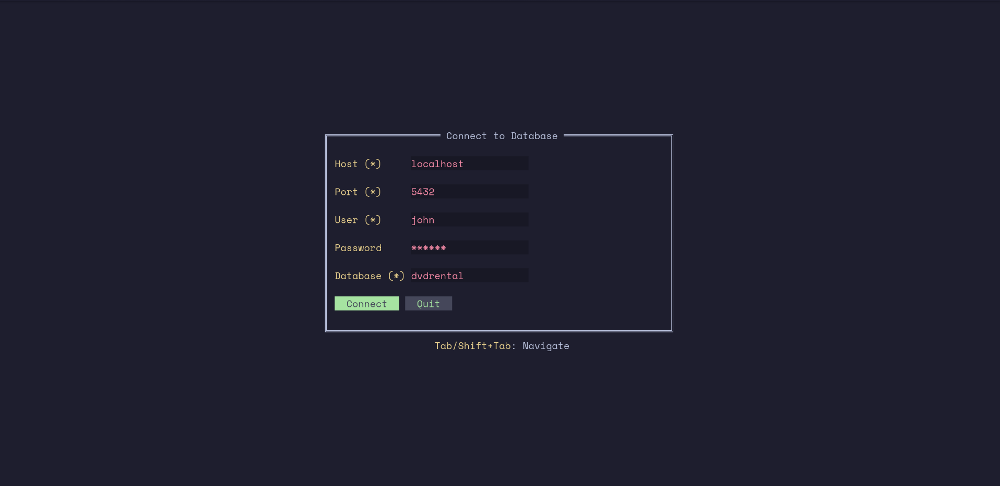

# dbterm

> **A modern, multi-database terminal client.**  
> Manage PostgreSQL, MySQL, and SQLite databases from a beautiful, keyboard-driven TUI.


## ✨ Features

- **Multi-Database Support**:  
  - 🐘 **PostgreSQL** (via `lib/pq`)  
  - 🐬 **MySQL** (via `go-sql-driver`)  
  - 📦 **SQLite** (pure Go, no CGO required)

- **Connection Manager**:  
  - Save, edit, and manage multiple connections.
  - **Service Dashboard**: Monitor MySQL/PostgreSQL system services, ports, RAM usage, and start/stop them directly from the TUI.

- **Powerful Workspace**:  
  - **Query Editor**: Write and execute SQL with `Alt+Enter`.
  - **Results Table**: Sortable columns, fullscreen toggle (`Alt+F`), and frozen headers for easy reading.
  - **Smart Refresh**: `F5` refreshes data while preserving your row selection and sort order.

- **Keyboard Driven**:  
  - `Tab` cycles focus between Tables, Query, and Results.
  - Shortcuts for everything—never touch the mouse.

---

## 📸 Screenshots

### Connection Dashboard


---

## 📦 Installation

### Go install

```bash
go install github.com/shreyam1008/dbterm@latest
```

If your local Go is older than the version required by `go.mod`, Go may print:

```text
requires go >= 1.24.0; switching to go1.24.x
```

That is expected and means the Go toolchain auto-upgraded for this install.

Make sure your Go bin directory is in your `PATH`:

```bash
export PATH=$PATH:$(go env GOPATH)/bin
```

Then run:

```bash
dbterm
```

### APT (Ubuntu/Debian)

After adding the dbterm APT source once:

```bash
echo "deb [arch=$(dpkg --print-architecture) trusted=yes] https://shreyam1008.github.io/dbterm/apt stable main" | sudo tee /etc/apt/sources.list.d/dbterm.list >/dev/null
sudo apt update
sudo apt install dbterm
```

The repository is published from GitHub Actions release builds to the `gh-pages` branch.

---

## ⌨️ Shortcuts

### Global
| Key | Action |
|---|---|
| `Alt + S` | **Open Service Dashboard** (Manage MySQL/PG services) |
| `Alt + D` | Go to Connection Dashboard |
| `Alt + H` | Toggle Help & Cheatsheets |
| `Ctrl + C` | Quit |

### Workspace
| Key | Action |
|---|---|
| `Tab` | Cycle focus: **Tables** → **Query** → **Results** |
| `Alt + Enter` | Execute Query |
| `F5` | **Refresh current table** (preserves selection & sort) |
| `Ctrl + F5` | **Refresh database view** (table list + current table) |
| `Alt + Q` | Focus Query Editor |
| `Alt + R` | Focus Results Table |
| `Alt + F` | Toggle **Fullscreen Results** |
| `S` | **Sort** results by selected column |

### Service Dashboard
| Key | Action |
|---|---|
| `1` | Toggle **MySQL** Start/Stop |
| `2` | Toggle **PostgreSQL** Start/Stop |
| `R` | Refresh status |

---

## 🔧 Technical Details

**dbterm** is a fork and major expansion of [pgterm](https://github.com/nabsk911/pgterm).
- **Language**: Pure Go
- **UI Framework**: [tview](https://github.com/rivo/tview) & [tcell](https://github.com/gdamore/tcell)
- **Zero Dependencies**: Connects to SQLite without CGO.

### License
MIT
