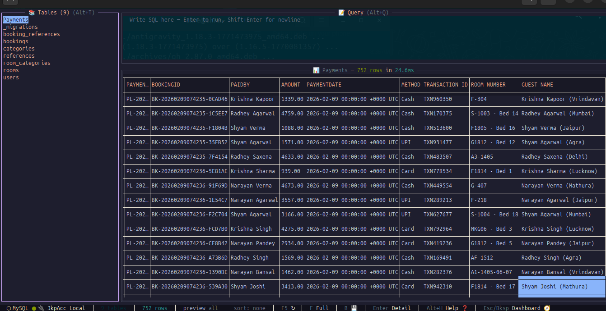
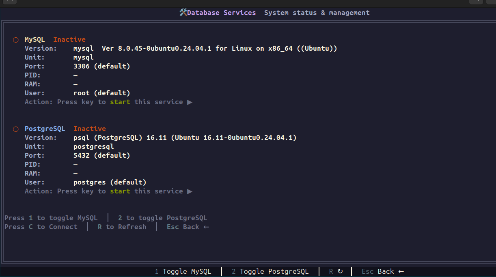
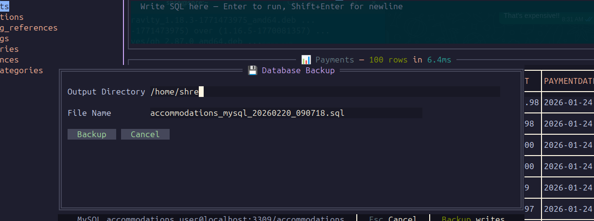

# dbterm

Open-source, keyboard-first terminal client for SQL workflows.

[](https://pkg.go.dev/github.com/shreyam1008/dbterm)
[](LICENSE)

`dbterm` is a single binary that lets you connect, query, and operate across multiple databases without heavyweight desktop tooling.



## Why dbterm

- Single binary install for Linux, macOS, and Windows.
- Keyboard-driven TUI with fast panel navigation.
- Supports PostgreSQL, MySQL, SQLite, Turso (LibSQL), and Cloudflare D1.
- Built-in service dashboard plus backup/import flows for PostgreSQL/MySQL.
- Low overhead runtime (roughly ~8-12 MB idle in typical use).

## Highlights

*Connection management + service controls in one terminal workflow.*


*SQL editing + result exploration with keyboard-first controls.*

## Quick install

### Linux / macOS

```bash
curl -fsSL https://raw.githubusercontent.com/shreyam1008/dbterm/main/install.sh | bash
```

### Windows (PowerShell)

```powershell
powershell -NoProfile -ExecutionPolicy Bypass -Command "irm https://raw.githubusercontent.com/shreyam1008/dbterm/main/install.ps1 | iex"
```

## Documentation

- Website: <https://shreyam1008.github.io/dbterm/>
- Product guide: <https://shreyam1008.github.io/dbterm/guide/>
- Open-source handbook: <https://shreyam1008.github.io/dbterm/open-source/>
- Go package page: <https://pkg.go.dev/github.com/shreyam1008/dbterm>

## Supported databases

| Database | Status |
| --- | --- |
| PostgreSQL | Query + backup + import + service controls |
| MySQL | Query + backup + import + service controls |
| SQLite | Query and local file workflows |
| Turso (LibSQL) | Cloud SQLite-compatible querying |
| Cloudflare D1 | D1 API-backed SQL querying |

## CLI reference

| Command | Purpose |
| --- | --- |
| `dbterm` | Launch TUI |
| `dbterm --help` | Show help |
| `dbterm --version` | Show version/build info |
| `dbterm --info` | Show install/config/runtime info |
| `dbterm --update` | Update to latest release |
| `dbterm --update X.Y.Z` | Update to a specific release |
| `dbterm --uninstall` | Remove binary with confirmation |
| `dbterm --uninstall --yes` | Remove binary without prompt |
| `dbterm --uninstall --purge` | Remove binary + saved connections |

## Core shortcuts

| Shortcut | Action |
| --- | --- |
| `Alt + Q / T / R` | Focus Query / Tables / Results |
| `Enter` | Execute query (in Query panel) |
| `Shift + Enter` | New line in Query panel |
| `Alt + Y` | Open query history (newest first) |
| `Alt + , / Alt + G` | Open Settings page |
| `Alt + A / Alt + C` | Select all result rows / clear selection |
| `Alt + H` | Open help + SQL cheatsheets |
| `G` (Dashboard) | Open Settings page from dashboard |
| `Alt + D` | Return to dashboard |
| `Alt + S` | Open services dashboard |
| `Alt + F / Alt + B / Alt + I` | Toggle fullscreen results / open backup modal / open SQL import modal |
| `Alt + E` | Export current results table to CSV |
| `Alt + = / - / 0` | Increase / decrease / toggle preview row limit |
| `Ctrl + = / - / 0` | Zoom all result columns / reset zoom |
| `+ / -` | Widen / narrow selected result column |
| `F5 / Ctrl + F5` | Refresh table / full refresh |
| `Ctrl + C` | Quit |

## SQL dump import (PostgreSQL/MySQL)

- Press `Alt + I` while connected to a PostgreSQL or MySQL database.
- Enter the `.sql` file path and keep `Stop on first error` enabled for safer imports.
- dbterm runs the official client tools (`psql` for PostgreSQL, `mysql` for MySQL), streams output live, then shows success/failure.
- Required binaries in `PATH`: `psql` (PostgreSQL) and/or `mysql` (MySQL).

## Settings + keymap config

- Open settings with `G` from Dashboard or `Alt + ,` / `Alt + G` in workspace.
- Settings are persisted to `~/.config/dbterm/settings.json`.
- Key bindings are validated before save (duplicate/invalid mappings are blocked).
- Query history remains enabled per connection; saved-query snippet library is intentionally not included.

## Performance footprint

`dbterm` is tuned for small binary/runtime overhead while staying feature-complete:

- Build strips debug and VCS metadata (`-trimpath -buildvcs=false -ldflags="-s -w -buildid="`).
- DB pool is intentionally small (`max open=2`, `max idle=1`) for lower idle memory.
- Read-query previews respect the active preview limit (default `100` rows).
- `Alt + 0` switches preview to all rows when full result loading is required.

## Build locally

```bash
make build
```

Run tests:

```bash
make test
```

Build website:

```bash
cd site
npm install
npm run build
```

## Release automation

GitHub Actions release workflow reads the first non-comment line in `releases/versions.txt`:

```text
<version>|<release name>|<short description>
```

On push to `main`, it builds artifacts, publishes release assets/checksums, and updates install targets.

## Acknowledgments

dbterm was initially inspired by [pgterm](https://github.com/nabsk911/pgterm) by @nabsk911.

The project is now independently developed and has significantly expanded in scope and features.

## Contributing

Read `CONTRIBUTING.md` for starter-friendly guidance on submitting issues and pull requests.

## License

dbterm is MIT licensed.

- Canonical license file: `LICENSE`
- Open-source + license references: <https://shreyam1008.github.io/dbterm/open-source/>
- Package docs: <https://pkg.go.dev/github.com/shreyam1008/dbterm>
